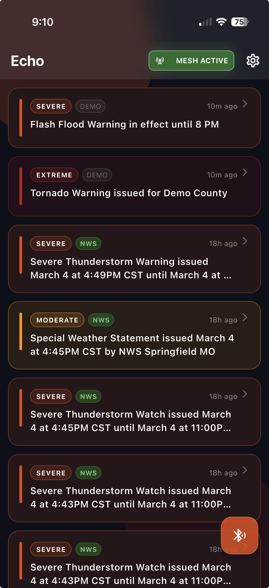
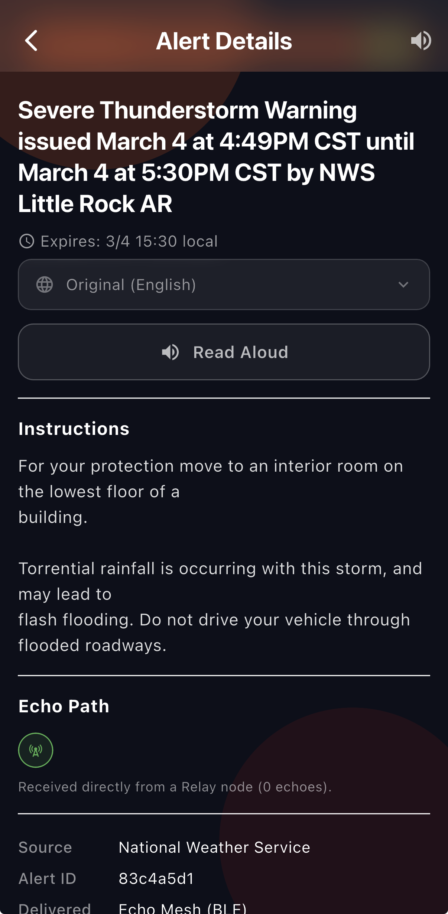
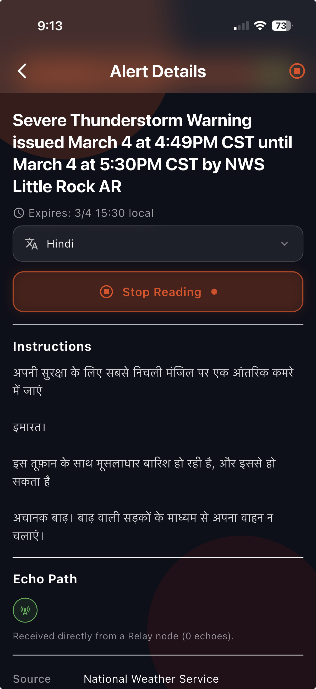

# Echo — Offline Emergency Alert Mesh

> **No internet. No cell service. No infrastructure required.**
> One device with a connection becomes the seed. Every phone that receives an alert automatically becomes a Relay — spreading it further through the crowd over Bluetooth.

<p align="center">
  
  &nbsp;&nbsp;&nbsp;
  
  &nbsp;&nbsp;&nbsp;
  
</p>

---

## Table of Contents

1. [How It Works](#how-it-works)
2. [Architecture](#architecture)
3. [BLE Protocol](#ble-protocol)
4. [Data Model](#data-model)
5. [Echo Path (Hop Counting)](#echo-path-hop-counting)
6. [App Features](#app-features)
7. [Native Offline Translation](#native-offline-translation)
8. [Settings & NWS Filtering](#settings--nws-filtering)
9. [Project Structure](#project-structure)
10. [Dependencies](#dependencies)
11. [Build & Run](#build--run)
12. [Relay Node (beacon_cli / Pi Sender)](#relay-node-beacon_cli--pi-sender)
13. [Platform Notes](#platform-notes)
14. [Debugging BLE](#debugging-ble)
15. [Demo Walkthrough](#demo-walkthrough)

---

## How It Works

```
┌─────────────────┐    BLE GATT     ┌──────────────┐    BLE GATT     ┌──────────────┐
│  Relay Node     │ ──────────────► │   Echo A     │ ──────────────► │   Echo B     │
│  (Pi / laptop / │  alert JSON     │  1 echo      │  re-broadcasts  │  2 echoes    │
│   phone w/ net) │  in chunks      │  (no Wi-Fi)  │  alert          │  (no Wi-Fi)  │
│                 │                 │              │                 │              │
│ NWS API fetch   │                 │ Stores alert │                 │ Stores alert │
│ + GATT server   │                 │ Re-advertises│                 │ Re-advertises│
└─────────────────┘                 └──────────────┘                 └──────────────┘
        ▲
        │ HTTPS
┌───────────────┐
│  NWS GeoJSON  │
│  alerts/active│
└───────────────┘
```

1. A **Relay node** (Pi, laptop running `beacon_cli`, or a phone with internet) fetches live alerts from the National Weather Service API.
2. It advertises the alert over BLE using a custom GATT server, chunking the JSON payload across multiple characteristic reads.
3. Any nearby **Echo** (phone running the app) scans for the service UUID, connects, downloads and reassembles the chunks, and saves the alert to local SQLite.
4. That Echo then **re-advertises** the same alert — becoming a Relay node in the gossip mesh.
5. Each relay increments the **echo counter**, so recipients see exactly how many devices the alert traveled through to reach them.
6. A deduplication check (`alertIdHash` in BLE advertisement + SQLite lookup) prevents infinite relay loops.

---

## Architecture

Echo uses a **unified mesh node** model. Every device simultaneously acts as both broadcaster and scanner — there are no fixed gateway or receiver roles.

### Two Execution Contexts

| Context | Runs |
|---|---|
| **Main Flutter isolate** | UI, `GattServer` (MethodChannel → native BLE), foreground BLE scan, NWS fetch |
| **Background isolate** (`flutter_background_service`) | Autonomous 5-minute mesh loop: scan → deduplicate → download → persist → notify main |

> **Critical constraint:** `GattServer` uses a `MethodChannel` registered only in the main Flutter engine (`MainActivity` / `AppDelegate`). Calling it from the background isolate throws `MissingPluginException`. All GATT server operations must stay in the main isolate.

### IPC Between Isolates

```
Background ──► 'serviceStarted' ──► Main  (activates MESH ACTIVE badge + pulse)
Background ──► 'meshAlert'      ──► Main  (calls GattServer.restart, reloads DB)
Main       ──► 'notifyAlert'    ──► Background  (keeps background DB in sync after NWS fetch)
```

### Background Mesh Loop (runs immediately, then every 5 minutes)

```
scanForMesh(15 seconds)
  └─ for each Relay beacon found:
       └─ alertIdHash already in DB? ──yes──► skip  (loop prevention)
                                     ──no───► GattClient.downloadAlert()
                                                └─ echoCount + 1
                                                └─ persist to SQLite
                                                └─ emit 'meshAlert' IPC → main isolate
                                                └─ break  (one new alert per cycle)
```

---

## BLE Protocol

### Service & Characteristic UUIDs

| Role | UUID |
|---|---|
| Service | `0000BCBC-0000-1000-8000-00805F9B34FB` |
| Alert characteristic (READ) | `0000BCB1-0000-1000-8000-00805F9B34FB` |
| Control characteristic (WRITE) | `0000BCB2-0000-1000-8000-00805F9B34FB` |
| Manufacturer ID | `0x1234` |

### Advertisement Payload

Packed into the 31-byte BLE advertisement alongside the service UUID:

```
[severity   : 1 byte ]   0=Extreme, 1=Severe, 2=Moderate, 3=Minor, 4=Unknown
[alertIdHash: 4 bytes]   first 4 bytes of SHA-1(headline + expires)
[fetchedAt  : 4 bytes]   Unix epoch, big-endian
```

Receivers filter on the service UUID **or** by BLE device name `"BeConnect"` (iOS fallback — CoreBluetooth sometimes omits service UUIDs from advertisement data). Severity and `alertIdHash` are parsed from manufacturer data to decide whether to connect — without touching GATT.

### GATT Chunk Transfer

```
Receiver                                  GATT Server (Relay)
   │                                             │
   │── connect() + requestMtu(512) ─────────────►│
   │◄─── mtuChanged(512) ────────────────────────│
   │── discoverServices() ──────────────────────►│
   │                                             │
   │  repeat for i = 0 .. totalChunks - 1:       │
   │── write(controlChar, [i >> 8, i & 0xFF]) ──►│  ← "give me chunk i"
   │── read(alertChar) ─────────────────────────►│
   │◄─── [i:2 BE][total:2 BE][payload:≤508 B] ───│
   │                                             │
   │── disconnect() ────────────────────────────►│
   │                                             │
   reassemble → JSON → AlertPacket
```

**Frame format:**

```
┌──────────────┬────────────────┬──────────────────────────┐
│ chunkIndex   │  totalChunks   │  payload                 │
│  2 bytes BE  │  2 bytes BE    │  up to 508 bytes         │
└──────────────┴────────────────┴──────────────────────────┘
```

- Native chunk size: **508 bytes** (512 MTU − 4-byte header)
- GATT error 133 on Android is normal on first connect — `GattClient` automatically retries once after 600ms

---

## Data Model

```dart
@JsonSerializable()
class AlertPacket {
  final String  alertId;      // First 8 hex chars of SHA-1(headline + expires)
  final String  severity;     // "Extreme" | "Severe" | "Moderate" | "Minor" | "Unknown"
  final String  headline;
  final int     expires;      // Unix epoch seconds
  final String  instructions;
  final String  sourceUrl;
  final bool    verified;     // true = fetched directly from NWS
  final int     fetchedAt;    // Unix epoch seconds (local receipt time)
  final int?    sentAt;       // Unix epoch seconds (NWS-issued time; null for BLE-relayed)
  final bool    pinned;       // User-pinned; survives the 20-alert prune
  final int     hopCount;     // 0 = origin; incremented +1 per BLE relay hop
}
```

### SQLite Schema — Version 4

```sql
CREATE TABLE alerts (
  alertId       TEXT    PRIMARY KEY,
  severity      TEXT    NOT NULL,
  headline      TEXT    NOT NULL,
  expires       INTEGER NOT NULL,
  instructions  TEXT    NOT NULL,
  sourceUrl     TEXT    NOT NULL,
  verified      INTEGER NOT NULL,
  fetchedAt     INTEGER NOT NULL,
  sentAt        INTEGER,               -- nullable; NWS-issued time
  pinned        INTEGER NOT NULL DEFAULT 0,
  hopCount      INTEGER NOT NULL DEFAULT 0
);
```

- Prunes to the **20 most recent** alerts automatically after every insert.
- Pinned alerts are excluded from pruning.
- Ordered by: `pinned DESC`, `fetchedAt DESC`.
- Migration history: v1 → v2 added `pinned`; v2 → v3 added `hopCount`; v3 → v4 added `sentAt`.

---

## Echo Path (Hop Counting)

| Scenario | `hopCount` stored |
|---|---|
| NWS fetch or demo loaded directly on this device | **0** |
| Relay → Echo A (direct receive) | **1** |
| Relay → Echo A → Echo B | **2** |
| Relay → A → B → C | **3** |

The alert detail screen renders this as a visual node chain:

```
  🟢 ───────── ⚪ ───────── 📱
origin        relay       you
(Relay/NWS)  (1 Echo)    (2 echoes)
```

Nodes: green tower = origin Relay, white bluetooth circles = relaying Echo devices, blue phone = this device.

Plain-English examples shown under the chain:

- `hopCount: 0` → _"Received directly from NWS (no echoes)"_
- `hopCount: 1` → _"Relayed directly from a Relay node (1 echo)"_
- `hopCount: 3` → _"Echoed through 2 devices before reaching you (3 echoes)"_

---

## App Features

### Home Screen

| Feature | Description |
|---|---|
| Auto-scan on launch | 15-second foreground BLE scan runs immediately after permissions are granted |
| **MESH ACTIVE chip** | Green with breathing glow when background mesh is alive; turns **red "BT OFF"** when Bluetooth is disabled |
| Settings gear | Opens the Settings screen (state filter, NWS fetch, demo load) |
| Manual re-scan FAB | BLE search FAB in the bottom corner; scales in with elastic-out animation |
| Staggered alert cards | Cards slide up and fade in with 50ms stagger per card |
| Severity glow | Extreme and Severe cards have a pulsing colored outer glow |
| **Swipe-left to reveal** | Swipe any card left to reveal circular Pin and Delete action buttons |
| **One card at a time** | Opening a swipe on one card automatically closes all others |
| Press scale | Cards scale to 0.97× on press for tactile feedback |
| **Alert tags** | Green **NWS** badge for verified NWS alerts; dim **DEMO** pill for demo alerts; no tag for BLE-relayed alerts |
| NWS sent time | Alert cards show the NWS-issued timestamp (`sentAt`) when available; falls back to received-ago age |

### Alert Detail Screen

| Feature | Description |
|---|---|
| Severity banner | Colored glass panel with icon and severity label; Extreme/Severe have outer glow |
| **Language picker** | Glass row tapping opens a glass bottom sheet — choose from 23 languages to translate the alert instructions |
| **Offline translation** | Native on-device translation (iOS 18+ Translation framework / Android ML Kit); no internet required after model download |
| Read Aloud | Full-width button + AppBar icon; speaks instructions in the **selected language** via native TTS |
| TTS language | Automatically set to match the chosen translation language (e.g. Spanish → `es-ES`, Hindi → `hi-IN`) |
| Auto-stop TTS | Stops automatically when navigating back |
| **Echo Path** | Visual node chain showing origin → relay echoes → this device |
| **Issued time** | "Issued" row shows the NWS-issued `sentAt` time when available |
| Expiry time | Formatted local date/time |
| Metadata | Source URL, Alert ID, delivery path |

### Design System

- **Dark glassmorphism** — dark navy base (`#0D0F1A`), two animated warm gradient blobs (17s and 19s drift cycles) behind all content, `BackdropFilter` blur on fixed surfaces only (AppBar, Settings, modals, language picker).
- **Severity color scale** — 5 levels from soft yellow (Minor) through amber → orange → red → deep crimson (Extreme). Every card, badge, border, and glow is dynamically colored by severity.
- **Glass swipe actions** — revealed Pin/Delete buttons are circular, glass-style, fully rounded on all edges.
- **Page transitions** — fade + 4% slide-up applied to both iOS and Android, replacing the default platform slide.
- **No blur inside list items** — `BackdropFilter` is deliberately excluded from `SliverList` children to prevent jank.

---

## Native Offline Translation

Echo supports on-device translation of alert instructions into 23 languages without any internet connection after initial model download.

### Supported Languages

| Language | Code | TTS Locale |
|---|---|---|
| Arabic | `ar` | `ar-SA` |
| Chinese (Simplified) | `zh` | `zh-CN` |
| Dutch | `nl` | `nl-NL` |
| French | `fr` | `fr-FR` |
| German | `de` | `de-DE` |
| Greek | `el` | `el-GR` |
| Hebrew | `he` | `he-IL` |
| Hindi | `hi` | `hi-IN` |
| Indonesian | `id` | `id-ID` |
| Italian | `it` | `it-IT` |
| Japanese | `ja` | `ja-JP` |
| Korean | `ko` | `ko-KR` |
| Norwegian | `nb` | `nb-NO` |
| Polish | `pl` | `pl-PL` |
| Portuguese | `pt` | `pt-BR` |
| Russian | `ru` | `ru-RU` |
| Spanish | `es` | `es-ES` |
| Swedish | `sv` | `sv-SE` |
| Thai | `th` | `th-TH` |
| Turkish | `tr` | `tr-TR` |
| Ukrainian | `uk` | `uk-UA` |
| Vietnamese | `vi` | `vi-VN` |

### Platform Implementation

| Platform | Framework | Requirement |
|---|---|---|
| iOS | Apple Translation framework | iOS 18.0+ |
| Android | Google ML Kit Translation | Any Android; models download on first use |

- On iOS < 18.0, the language dropdown is shown but selecting a language displays a snackbar: _"Translation requires iOS 18.0+"_
- The language picker only shows languages with a downloaded model on iOS (checked via `LanguageAvailability`). On Android, all 22 languages are always shown (ML Kit downloads the model on first use).
- Read Aloud automatically uses the TTS locale matching the selected translation language.

---

## Settings & NWS Filtering

Tap the **gear icon** in the top-right corner to open Settings.

### Data Sources

| Button | Action |
|---|---|
| **Download NWS Alerts** | Fetches up to 5 active alerts from `api.weather.gov` filtered by selected states |
| **Load Demo Alerts** | Injects hardcoded sample alerts (Extreme + Severe) for offline testing |

### NWS State Filter

Select one or more US states to filter NWS alerts geographically. The app appends `&area=CA,TX,...` to the NWS API request. When no states are selected, alerts for all states are fetched.

- Selected states are persisted to `SharedPreferences` and survive app restarts.
- Tap **Clear** to deselect all states and revert to fetching all states.
- Changes take effect on the next NWS fetch.

---

## Project Structure

```
lib/
├── main.dart                          # App entry, ThemeData, page transitions
├── ble_constants.dart                 # Service UUIDs, manufacturer ID, severity byte mapping
├── ble/
│   ├── ble_advertiser.dart            # Thin delegate → GattServer
│   ├── ble_scanner.dart               # BLE scan + filter by serviceUuid + device name fallback
│   ├── gatt_client.dart               # Connect, chunked download, hopCount increment
│   ├── gatt_server.dart               # MethodChannel bridge: start / stop / restart
│   └── chunk_utils.dart               # Frame encode / decode / reassemble
├── network/
│   ├── alert_fetcher.dart             # NWS GeoJSON HTTP client; supports state area filter
│   └── alert_parser.dart              # GeoJSON features → AlertPacket (parses sentAt)
├── data/
│   ├── alert_packet.dart              # Data model + json_serializable; includes sentAt: int?
│   ├── alert_packet.g.dart            # ⚠️ Generated — do not edit
│   ├── alert_database.dart            # SQLite singleton, schema v4, auto-migration
│   └── alert_dao.dart                 # insert, hasAlert, fetchAll, setPinned, delete, prune
├── service/
│   └── gateway_background_service.dart  # Background isolate, mesh loop, IPC events
├── services/
│   └── translation_service.dart       # MethodChannel wrapper for native translation
├── utils/
│   └── permissions.dart               # requestBlePermissions() — iOS + Android
├── ui/
│   ├── home_screen.dart               # Main screen: swipe cards, mesh chip, scan FAB
│   ├── settings_screen.dart           # State multi-select + NWS/Demo action buttons
│   ├── theme/
│   │   └── severity_colors.dart       # main(), tint(), border(), hasGlow() helpers
│   ├── widgets/
│   │   ├── glass_scaffold.dart        # Dark bg + animated drifting blobs
│   │   └── glass_container.dart       # Reusable blurred glass panel widget
│   └── receiver/
│       └── alert_detail_screen.dart   # Detail: translation picker, TTS, echo chain, metadata
└── demo/
    └── demo_alerts.dart               # Hardcoded fallback AlertPackets (verified: false)

android/app/src/main/kotlin/.../
└── MainActivity.kt                    # BluetoothLeAdvertiser + BluetoothGattServer
                                       # 508-byte chunks, per-device chunk index tracking
                                       # ML Kit Translation channel handler

ios/Runner/
└── AppDelegate.swift                  # CBPeripheralManager, same 508-byte chunks
                                       # Apple Translation channel handler (iOS 18.0+)

assets/
├── icon/
│   └── app_icon.png                   # 1024×1024 source — flutter_launcher_icons generates all sizes
└── sample/
    ├── home.png                       # Home screen screenshot
    ├── Alert.png                      # Alert detail screenshot
    └── Alert_Hindi.png                # Alert detail with Hindi translation

beacon_cli/                            # Cross-platform BLE Relay node (macOS + Windows)
pi_sender/                             # Raspberry Pi Relay node (Linux / BlueZ)
```

---

## Dependencies

### Flutter — Runtime

| Package | Version | Purpose |
|---|---|---|
| `flutter_blue_plus` | ^1.32.0 | BLE central (scan) + peripheral (advertise) on Android & iOS |
| `http` | ^1.2.0 | NWS GeoJSON API requests |
| `sqflite` | ^2.3.0 | Local SQLite persistence |
| `path_provider` | ^2.1.0 | Database file path resolution |
| `json_annotation` | ^4.9.0 | `@JsonSerializable` annotations |
| `flutter_background_service` | ^5.0.5 | Background isolate + foreground notification (Android) |
| `permission_handler` | ^11.3.0 | Runtime BLE + location + notification permissions |
| `crypto` | ^3.0.3 | SHA-1 for `alertId` generation |
| `flutter_tts` | ^4.0.2 | Native iOS `AVSpeechSynthesizer` / Android `TextToSpeech` |
| `shared_preferences` | ^2.3.0 | Persist selected NWS states across restarts |

### Flutter — Dev

| Package | Purpose |
|---|---|
| `build_runner` | Code generation runner |
| `json_serializable` | Generates `alert_packet.g.dart` from annotations |
| `flutter_launcher_icons` | Generates all required icon sizes from a single 1024×1024 source |

### Native — iOS

| Framework | Purpose |
|---|---|
| `CoreBluetooth` | BLE GATT peripheral (advertising) |
| `Translation` *(iOS 18.0+)* | On-device text translation via Apple Intelligence |
| `SwiftUI` | Required to host `TranslationSession` in a zero-size view |

### Native — Android

| Library | Purpose |
|---|---|
| `BluetoothLeAdvertiser` | BLE GATT peripheral |
| `com.google.mlkit:translate` | On-device ML Kit translation |

### Relay Node — Python

| Package | Purpose |
|---|---|
| `bless` | Cross-platform BLE GATT peripheral (macOS + Windows) — `beacon_cli` |
| `dbus-next` | BlueZ D-Bus GATT server (Raspberry Pi / Linux) — `pi_sender` |
| `pytest` *(dev)* | Unit test runner |

---

## Build & Run

### Prerequisites

- Flutter SDK ≥ 3.6.2 on your `PATH`
- Dart SDK ≥ 3.6.2 (bundled with Flutter)
- For iOS builds: macOS + Xcode 15+
- For Android builds: Android Studio + SDK Platform 34

### One-Time Setup

```bash
# Install Dart/Flutter dependencies
flutter pub get

# Regenerate JSON serialization code
# (Only needed after editing alert_packet.dart)
dart run build_runner build --delete-conflicting-outputs

# Regenerate app icons
# (Only needed after replacing assets/icon/app_icon.png)
dart run flutter_launcher_icons
```

### Daily Commands

```bash
# Run on connected device (debug)
flutter run

# Lint — must report 0 issues
flutter analyze

# Unit tests
flutter test

# Watch mode for JSON codegen during development
dart run build_runner watch --delete-conflicting-outputs
```

### Release Builds

```bash
# Android APK
flutter build apk --release

# Android App Bundle (Play Store)
flutter build appbundle --release

# iOS IPA (requires macOS + Xcode)
flutter build ipa --release
```

### Platform Targets

| Platform | Minimum | Target |
|---|---|---|
| Android | API 26 (Android 8.0) | API 34 (Android 14) |
| iOS | 14.0 | latest |

---

## Relay Node (beacon_cli / Pi Sender)

Two self-contained Relay node implementations — both fully wire-compatible with the Echo app (same BLE UUIDs, GATT protocol, advertisement format).

### `beacon_cli` — macOS & Windows

See **[beacon_cli/README.md](beacon_cli/README.md)** for full setup and command reference.

```bash
cd beacon_cli
python3 -m venv .venv && source .venv/bin/activate   # Windows: .venv\Scripts\activate
pip install -e .

beacon new --headline "Tornado Warning" --severity Extreme \
  --expires 1893456000 --instructions "Seek shelter now." --source-url "local://op"
beacon publish <alert_id>
beacon broadcast
```

### `pi_sender` — Raspberry Pi / Linux

```bash
# Requirements: Python 3.10+, BlueZ, D-Bus
sudo apt-get update
sudo apt-get install -y bluetooth bluez python3-dbus python3-venv

cd pi_sender
python3 -m venv .venv && source .venv/bin/activate
pip install -e .

beconnect-pi alert new \
  --headline "Severe Thunderstorm Warning" \
  --severity Severe \
  --expires 1893456000 \
  --instructions "Move indoors immediately. Avoid windows." \
  --source-url "local://operator" \
  --verified false

beconnect-pi publish <alert_id>
beconnect-pi broadcast start
beconnect-pi status
```

#### Pi State Files (`~/.beconnect-pi/`)

| File | Contents |
|---|---|
| `alerts.json` | All saved alerts |
| `current_alert.json` | The currently published alert |
| `broadcaster.pid` | PID of the background daemon |
| `broadcaster.log` | Daemon log output |

The broadcaster polls `current_alert.json` every 2 seconds — running `beconnect-pi publish` while the daemon is running **hot-swaps** the alert without a restart.

---

## Platform Notes

### Android

- BLE advertising requires a **physical device** — Android emulators do not support `BluetoothLeAdvertiser`.
- The background service runs as a **foreground service** with a persistent notification (mandatory on Android 14+ with `foregroundServiceType: connectedDevice`).
- `ACCESS_FINE_LOCATION` is required for BLE scanning on some devices even with `usesPermissionFlags="neverForLocation"` set.
- Impeller is disabled in the manifest (`EnableImpeller = false`) for compatibility with `flutter_background_service`.

### iOS

- BLE scanning requires the app to be in the **foreground** unless `bluetooth-central` background mode is active (it is, per `Info.plist`).
- `CBPeripheralManager` silently drops custom manufacturer data when advertising. The service UUID is still broadcast and is sufficient for filtering.
- The iOS Simulator does **not** support Bluetooth — always test on a physical device.
- **Translation requires iOS 18.0+.** On older versions, selecting a language shows a snackbar explaining the requirement.
- iOS `withServices` hardware scan filter can strip `serviceUuids` from delivered advertisement data — the scanner filters in software and also accepts devices by BLE name `"BeConnect"` as a fallback.

### Text-to-Speech

| Platform | Engine | Notes |
|---|---|---|
| iOS | `AVSpeechSynthesizer` | Always available; no permissions required |
| Android | `android.speech.tts.TextToSpeech` | Present on all standard installs; no permissions required |

Speech rate is set to **0.45×** (slightly below default) for clear, deliberate reading — optimized for comprehension during an emergency. The language is automatically set to match the selected translation.

---

## Debugging BLE

| Symptom | Likely cause | Fix |
|---|---|---|
| Scan returns no results (Android) | `ACCESS_FINE_LOCATION` denied or location services off | Grant permission; enable Location in device Settings |
| Scan returns no results (iOS) | App backgrounded or BT permission not granted | Bring to foreground; check `NSBluetoothAlwaysUsageDescription` |
| Relay node not detected on iOS | `withServices` hardware filter stripping service UUIDs | Already handled — scanner falls back to matching BLE device name `"BeConnect"` |
| Advertising fails silently (Android) | Device doesn't support multiple advertisements | Use a physical device; call `isMultipleAdvertisementSupported()` to verify |
| GATT error 133 on first connect | Common Android race condition | Already handled — `GattClient` retries once after 600ms |
| Chunks reassemble to garbled JSON | Chunk size mismatch | Confirm native gateway uses 508-byte payload (512 MTU − 4 header bytes) |
| Background service not running | Permissions not granted or battery optimization on | Grant all permissions; disable battery optimization in Android Settings |
| `MissingPluginException` in background | `GattServer.start()` called from background isolate | All `GattServer` calls must stay in the main isolate; use IPC events instead |
| "Timed out waiting for CONFIGURATION_BUILD_DIR" | Transient Xcode bug | `pkill Xcode`, then re-run `flutter run` |

---

## Demo Walkthrough

End-to-end: from zero to alert on a second phone in under 60 seconds.

**Requirements:** one source device (Relay node or phone with Wi-Fi) + one or more receiver phones with Bluetooth ON and Wi-Fi OFF.

### Option A — beacon_cli / Pi as Relay

```bash
beacon new --headline "Demo Tornado Warning — seek shelter now" \
  --severity Extreme \
  --expires 9999999999 \
  --instructions "Go to the lowest floor of a sturdy building. Avoid windows." \
  --source-url "local://demo"

beacon publish <alert_id>
beacon broadcast
```

### Option B — Echo App as Source

1. Open Echo on a phone with Wi-Fi ON.
2. Tap the **gear icon** → **Download NWS Alerts** (live data) or **Load Demo Alerts** (offline test).
3. The app begins advertising automatically.

### Receiving on a Second Device

1. Open Echo on a second phone with **Wi-Fi OFF** and **Bluetooth ON**.
2. The app auto-scans within the first 15 seconds of launch.
3. The alert card appears with a green **NWS** tag (if live data) or dim **DEMO** tag (if demo).
4. Tap the card → tap **Read Aloud** to hear the alert via native TTS.
5. Tap the language picker to translate the instructions offline.

### Observing the Mesh Relay

1. Let Echo A (1 echo) remain open and running.
2. Bring a third phone (Echo B) within range of Echo A but out of range of the Relay.
3. Echo B receives the alert with `hopCount: 2`.
4. The Echo Path in the detail screen shows: `🟢 ── ⚪ ── 📱` (origin → Echo A → Echo B).

---

## License

Internal / hackathon project. Not for public distribution.
